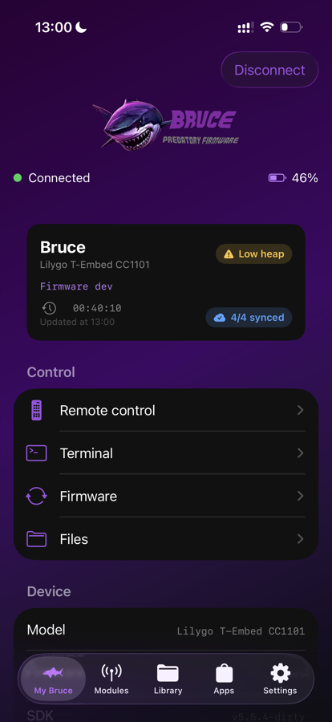
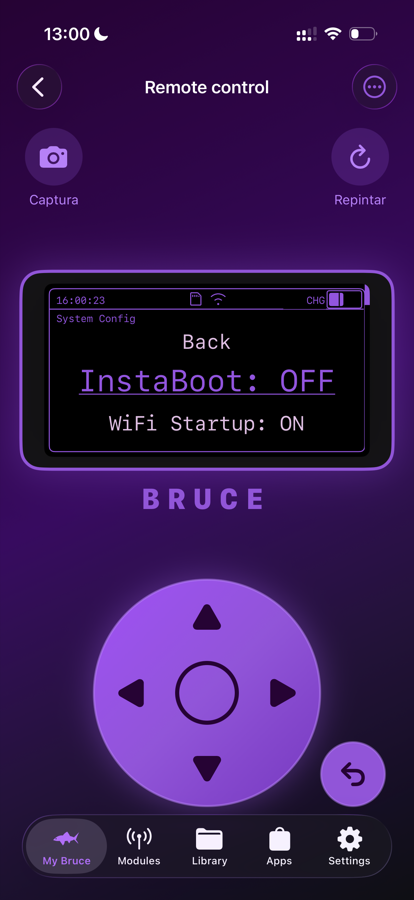
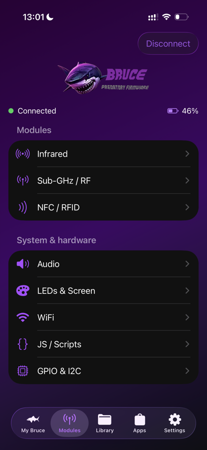
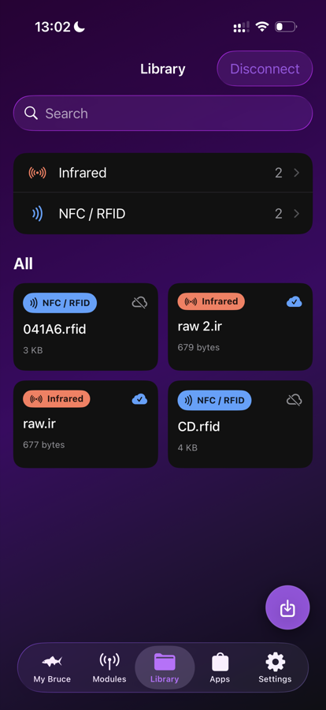
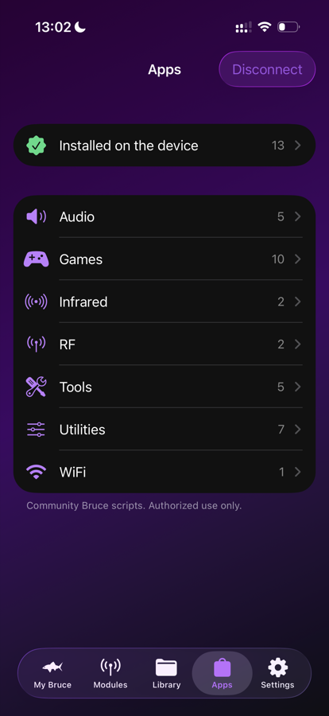
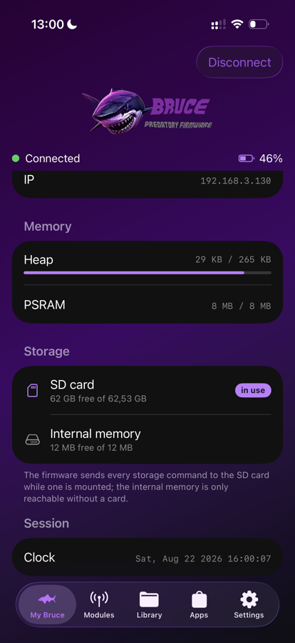

# Bruce Remote — iOS

**Your [Bruce](https://bruce.computer), in your pocket.**

Pair over Bluetooth Low Energy and the device's screen shows up on your iPhone — live,
with a D-pad that drives the real firmware menus. No cable, no serial console, no
laptop. What you see and touch is the Bruce's own interface.

From there the whole board is yours. Capture an IR signal off a remote and fire it
straight back. Read an NFC tag, then emulate it. Replay Sub-GHz. Browse and edit the
device filesystem. Install apps from the community store in a couple of taps. And keep
every capture in an offline library that knows what is already on the device and what
still needs uploading.

Built in **SwiftUI + CoreBluetooth**. No third-party dependencies.

---

## Screenshots

|  |  |  |
|:--:|:--:|:--:|
|  |  |  |
| **My Bruce** — identity, health badges, controls | **Remote control** — the device screen, mirrored | **Modules** — what the Bruce transmits and senses |
|  |  |  |
| **Library** — offline archive of your captures | **Apps** — the community Bruce store | **Memory & storage** — heap, PSRAM, SD vs internal |

---

## Requirements

- **iPhone running iOS 17 or later.** CoreBluetooth does not work in the Simulator,
  so a physical device is required — both to build and to use.
- **Xcode 16 or later** to build.
- **A Bruce device with the BLE API enabled** (see below). Developed and tested
  against a **LilyGo T-Embed CC1101**; anything running Bruce with the BLE API and
  the serial command parser should work.

## Getting started

### 1. Enable the BLE API on the Bruce

On the device, go to **Config → Advanced → Toggle BLE API**. It is **off by default**,
and nothing in the app will find your Bruce until you turn it on.

### 2. Build and install

```sh
git clone https://github.com/BruceDevices/App-IOS.git
cd App-IOS
open "Bruce Remote.xcodeproj"
```

Signing is per-developer, so no team ID is committed. Set yours once:

```sh
cp Config/Local.xcconfig.example Config/Local.xcconfig
# then edit BRUCE_DEVELOPMENT_TEAM (and BRUCE_BUNDLE_ID if you need to)
```

`Config/Local.xcconfig` is git-ignored, so your identity never lands in a diff. Skip it
if you prefer and just pick a team in **Signing & Capabilities** — the project builds
either way. Then build to your iPhone.

> A free Apple ID works: apps signed with a personal team expire after 7 days and
> need a rebuild. A paid Apple Developer account raises that to a year. If a free
> Apple ID rejects the default bundle identifier, set `BRUCE_BUNDLE_ID` to something
> of your own.

### 3. Connect

Open the app and tap **Connect**. Bruce advertises as `Bruce` — but it disables scan
response and the advertising packet is truncated to `Bruc`, often *without* the
128-bit service UUID. The app therefore scans unfiltered and matches by name prefix,
then discovers whichever serial layout the device actually exposes.

Once linked, **My Bruce** probes the device (`info`, `free`, `storage free`) and fills
in the identity card, memory, and storage sections.

---

## What's in the app

Five tabs — **My Bruce**, **Modules**, **Library**, **Apps**, **Settings** — plus two
screens worth calling out on their own, both reached from My Bruce → Control.

### My Bruce

The device at a glance. The identity card carries the board name, model, firmware
version and uptime, plus two live badges: a **health warning** when the device is
running short (e.g. *Low heap*), and a **sync badge** (*4/4 synced*) telling you how
much of your Library is currently present on the device.

Below that: **Device** (model, firmware, commit, SDK, MAC, WiFi state, IP), **Memory**
(free heap against total, with a bar, and PSRAM), **Storage** (both filesystems, with
an *in use* badge on the active one), and **Session** (uptime and the device clock).
Battery level comes from the standard Battery Service (`0x180F`) when the board
exposes it.

The **Control** section is the jump-off point: **Remote control** (a D-pad that drives
the device's own UI), **Terminal**, **Firmware**, and — in advanced mode — **Files**.

> Terminal and Firmware are reachable while disconnected; Remote control and Files
> stay disabled until the link is up.

### Modules — what the Bruce transmits and senses

Two sections. **Modules** covers the radios — Infrared, Sub-GHz / RF, NFC / RFID.
**System & hardware** covers the rest of the board — Audio, LEDs & Screen, WiFi,
JS / Scripts, and (advanced mode only) GPIO & I2C.

**Infrared** — the full loop, Flipper-style: **capture** from a remote (`ir rx`),
**emulate** it right away to test (`ir tx_from_buffer`), and **save** to the phone
and/or to the device (`/BruceIR`, via a verified `storage write`). It also lists the
`.ir` files already on the device, transmits them (`ir tx_from_file`), and pulls down
offline copies.

> **Air conditioners need RAW.** Replaying from the decoded `state` will not drive the
> unit — the firmware itself forces raw for these (`raw = ... || hasACState(type)` in
> `ir_read.cpp`). The app has a Decoded/RAW selector and, when it spots a `state:` in
> the capture, warns you and switches to RAW.

**Sub-GHz / RF** — `subghz rx`, `subghz tx`, and replay from a saved `.sub`
(`subghz tx_from_file`).

**NFC / RFID** — read a tag (`rfid read`: UID, type, SAK, ATQA, pages and dump), save
it to the phone and/or the device as a Bruce-format `.rfid`, **emulate** it, **clone**
the UID onto a magic card, and load a saved dump back into the module
(`rfid loadfile`).

> The firmware driver holds **one** tag at a time, which is why the screen works in two
> steps: put a tag in the slot, then act on it. Note also that `rfid emulate` **blocks
> the device's serial** for up to 60 s (or until you press ESC on the device) — no other
> command is served in the meantime. The UI warns you before starting.

**JS / Scripts** — browse `/BruceJS` and run any `.js` with `js run_from_file`; stop
with `js exit`. This is what executes the items installed from the store.

Also here: **Audio** (`say`, `tone`, `music_player` — including a picker that browses
the device for `.mp3`/`.wav`), **LEDs & Screen** (`led r g b` with a color picker,
effects, `clock`), **WiFi** (`wifi on/off`, `wifi add`, `arp`, `sniffer`, `listen`,
`webui`), and **GPIO & I2C** (`i2c scan`, `gpio mode/set`).

### Library

An offline archive on the phone (`Documents/Library`) for everything you capture:
search, browse by category, favorite, import, rename, export/share, and **send back to
the Bruce** (with the option to transmit right after). You can also save straight into
the library from the device file manager. Works with no device connected.

Each card carries a **sync badge** showing whether that capture is currently present on
the device, so you can see at a glance what still needs uploading.

### Apps — the Bruce store

A client for the **community Bruce App Store** — the same catalog the on-device store
downloads from (`ghp.iceis.co.uk`). The phone is the store client: it fetches the
catalog over HTTPS, browses **categories → apps** (Audio, Games, Infrared, RF, Tools,
Utilities, WiFi), downloads the app files and writes them to the device over BLE into
`/BruceJS/<Category>`, then runs them with `js run_from_file`.

- **Install** with a progress bar (text files via `storage write`, binary assets via
  Y-modem), **Run** on the Bruce, **Update** when the catalog carries a newer version,
  and **Remove** (deleting exactly the files that were written).
- **Real device state**: on connect, the app reads `/BruceAppStore/installed.json` from
  the Bruce and merges it with its local ledger, so the Installed/Update badges and the
  **Installed on device** list reflect what is actually on the board — including apps
  installed by the on-device store. Install and remove mirror `installed.json` back
  with a read-merge-write that preserves third-party entries.
- Browsing works offline; install/run/remove stay disabled until the link is ready.
- Themes are out of scope for now (they are not executable scripts).

### Settings

**Power** (`power off` / `reboot` / `sleep`), and — in advanced mode — the firmware
**settings** editor (view all, change one) and **factory reset**.

The app's own section holds the **language** picker and the **Advanced mode** toggle.
Advanced mode is off by default; turning it on reveals GPIO & I2C in Modules, the
device file manager under My Bruce, and the firmware settings above.

### Remote control *(My Bruce → Control)*

The device's screen, mirrored on the phone, with a D-pad that drives the real firmware
menus. Nothing here is a parallel UI — what you see and touch is the Bruce's own
interface: the pad pushes presses into the device's input queue, and the device streams
back the draw calls it makes in response.

Bruce streams **draw calls, not pixels**, so the mirror is the replayed list of calls
needed to paint the current screen; a full-screen fill starts a new frame and discards
what came before. **Screenshot** saves the mirrored frame to the phone, and **Repaint**
asks the device to redraw when the stream drops something.

### Terminal *(My Bruce → Control)*

The raw serial CLI over BLE, with shortcuts for the usual diagnostics (`info`, `free`,
`uptime`, `date`). Everything the app does is built on these same text commands, so the
terminal is both an escape hatch and the best way to understand what the UI is sending.

### Firmware *(My Bruce → Control)*

Compares the version the device reports (`info`) against the latest GitHub release of
`BruceDevices/firmware`, shows the release notes and an **update available** badge, and
links to the [web flasher](https://bruce.computer/flasher) with the `.bin` for the
identified board.

> **It does not flash from the iPhone — and it can't.** The flasher uses Web Serial over
> USB, which iOS does not expose, and the firmware has no OTA path. The actual flash
> happens on a computer with Chrome and a USB cable.

---

## Language

The interface ships in **English and Brazilian Portuguese**. It follows the phone's
language by default, and Config lets you pin one. Strings live in a String Catalog
(`Localizable.xcstrings`); anything outside a SwiftUI `Text` goes through `L10n`, which
resolves against the `.lproj` of the selected language.

---

## Notes on device behaviour

These are firmware facts the app has to work around. They are worth knowing before
filing a bug.

### Storage is SD *or* LittleFS — never both

The firmware resolves the filesystem for **every** `storage` command in
`getFsStorage()` (`core/sd_functions.cpp`): the SD card when mounted, LittleFS
otherwise. No subcommand takes a storage argument, and there is no serial command to
unmount the card — so with a card inserted, internal memory is unreachable from the
CLI, and without one only LittleFS exists.

The app can't choose, so it **identifies**: `storage free sd` and `storage free
littlefs` (the only subcommand that names a filesystem) feed a storage report that
labels the file manager listing, shows both capacities at the root, and states which
storage the Library sync badge was computed against.

> Side effect worth knowing: `storage free sd` calls `setupSdCard()` in the firmware, so
> probing will **mount** a card inserted after boot. When that switches the active
> storage, the file index is discarded.

### Uploads: phone → device

Text files go one line per BLE write, terminated with `\n`, and closed with `EOF` —
the firmware's RX buffer is minimal (`readStringUntil` returns the whole characteristic
value), so the app paces the writes rather than streaming.

> Reliable uploads depend on a firmware with the **serial RX fix** (an RX ring buffer,
> and a `readStringUntil` that consumes and strips the terminator). Without it,
> `storage write` and `ir tx_from_buffer` drop bytes on longer payloads.

> The payload contract for `ir tx_from_buffer` includes the closing `#` line **before**
> `EOF` — that line is what triggers transmission. The app preserves the `#` from the
> captured `.ir` block.

### Binary uploads: Y-modem

`storage write` is text — it stops at the first byte that isn't valid UTF-8. Binary
files (images, fonts, `.bin`) go over **Y-modem**, in the exact subset the firmware
implements (`ymodemReceiveCallback`):

- **128-byte blocks only** (`SOH`); the receiver reads and discards `STX`.
- **CRC-16/XMODEM** (poly `0x1021`, seed `0x0000`), high byte first.
- A **header block** (sequence 0) carrying `name\0size\0` — the size is what allows
  trimming the final block at the right point, instead of stripping `0x1A` padding and
  taking legitimate `0x1A` bytes with it.
- **No final null block**: the receiver closes the file and returns on `EOT`.

The file manager importer picks the path on its own: if the content decodes as UTF-8 it
goes via `storage write`, otherwise Y-modem with a progress bar. During the binary phase
the `BLEManager` enters raw byte mode, since the protocol replies are loose bytes
(`C`, ACK, NAK) that the line assembler would hold forever.

> **There is no binary download.** `storage read` prints the file as text, and the
> firmware has no Y-modem send. Only phone → device is binary-safe.

### GATT

Bruce exposes a **custom serial service** with a **single characteristic** used in both
directions — write the command to it, subscribe to its notifications for the output.
Lines end in `\r\n`. Nordic UART Service is supported as a fallback for firmware
layouts that use it.

| Role | UUID |
|---|---|
| Serial service | `4371EC0B-3D43-49F9-B731-7C72A4A7BB91` |
| Serial characteristic (write + notify) | `D555ED97-BF2A-4F46-B3EB-D1FCDD7325E9` |
| NUS service (fallback) | `6E400001-B5A3-F393-E0A9-E50E24DCCA9E` |
| NUS RX (write, app → Bruce) | `6E400002-B5A3-F393-E0A9-E50E24DCCA9E` |
| NUS TX (notify, Bruce → app) | `6E400003-B5A3-F393-E0A9-E50E24DCCA9E` |
| Battery Level | `0x180F` / `0x2A19` |

---

## Project layout

```
Config/                Build settings; Local.xcconfig (git-ignored) holds signing
BruceRemote/
├── Bluetooth/         BLEManager (transport, line assembly, request/response), Y-modem
├── Protocol/          Typed command layer + models (BruceCommand, AppStore, LibraryStore…)
├── Views/             One SwiftUI screen per file
├── Theme/             BruceTheme — the bruce.computer palette
└── Localizable.xcstrings
```

The design rule worth preserving: **commands are typed, not concatenated.**
`BruceCommand` and its per-module enums (`IRCommand`, `SubGHzCommand`, `SystemCommand`,
`WiFiCommand`…) generate the command strings, so the CLI syntax lives in one place.
`RawCommand` is the escape hatch.

Request/response over a stream that has no framing is handled in `BLEManager` by
collecting output until the device goes quiet.

## Roadmap

- Store: include Themes; reconcile installed apps against what is actually on storage,
  to prune orphaned records (detect a factory reset).
- Firmware-side **OTA over WiFi**, which is what a real in-app update would require.
- BLE/nRF24 modules in fire-and-disconnect mode.
- Automatic reconnection, per-command timeouts, and BLE background mode.

## Contributing

Issues and PRs welcome. When adding a screen, add the command to the typed layer in
`Protocol/` first, and put every user-facing string in the String Catalog.

> Heads-up on the catalog: keys are currently the **Portuguese** source strings, with
> `en` and `pt-BR` translations hanging off each one. Migrating the keys to English is
> a welcome cleanup — until then, follow the existing convention so the catalog stays
> consistent.

## License

AGPL-3.0 — see [LICENSE](LICENSE).

> **Authorized use only.** This app drives hardware that transmits on RF and IR and
> reads NFC. Check your local regulations before transmitting.
